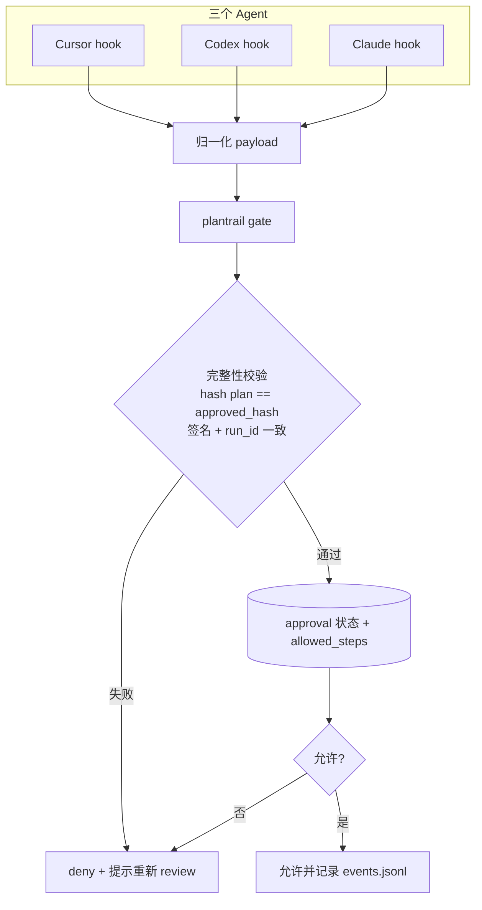
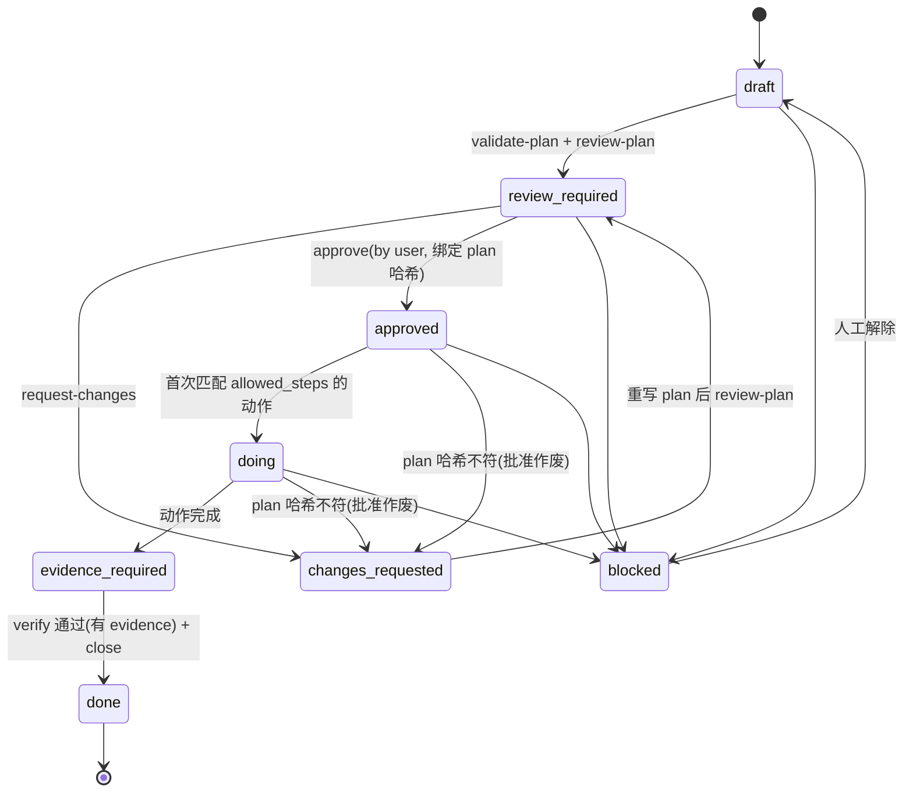

# plantrail：可审计 Agent 工作流工具包 — Spec

## 定位

plantrail 提供 **尽力拦截 + 强审计 + 完整性保护** 的 agent 工作流，而非操作系统级硬沙箱。原因：Cursor / Codex / Claude Code 三个工具的 hook 拦截都存在覆盖盲区与 fail-open 情况（详见“能力差异”）。plantrail 通过三条手段把可绕过空间压到最小：

1. **完整性保护**：批准与 plan 内容哈希绑定、权威状态放项目树外、gate 每次校验。
2. **强审计**：所有动作留痕到 `events.jsonl` 与阶段文档，可事后追责与回滚提示。
3. **hook 自检**：`status` 主动探测 hook 是否真生效，SKILL 要求 agent 每步前自检、失败即停。

固定工作流：

```text
需求 → 计划(plan) → 审查(review) → 审批门禁(approval) → 执行(doing) → 验证证据(evidence) → 总结(final)
```

核心原则：**没有被批准且未被篡改的计划，agent 不能进入执行阶段**；reviewer agent 只能写 `review.md` 给建议，只有用户经 `approve` 命令能放行。

## 目标与非目标

目标
- 强制每次任务走固定流程，全程落地为文件。
- 以 `approval.json` 为门禁判定中心（非“唯一真相源”：判定还依赖 plan 哈希 + run_id + 项目树外签名）。
- 一套内核 core，三个 agent 仅做接入层适配。
- 通过命令安装到项目级/全局；并提供面向 agent 的自助安装说明。

非目标
- 不改造现有业务代码（空仓库，纯新建工具包）。
- 不承诺硬沙箱 / 不可绕过；不追求三个 agent 能力完全等价。

## 已核实的关键能力差异（决定门禁实现）

- **Cursor**（`.cursor/hooks.json` 项目 / `~/.cursor/hooks.json` 全局，version 1）
  - `beforeShellExecution` 返回 `permission: deny|allow|ask` 拦 shell；`ask` 当前版本被静默忽略（已知 bug），高危动作一律用 `deny`。
  - 有通用 `preToolUse`（支持 `deny`），可做文件编辑的事前拦截；其各路径生效情况实现期需验证，`afterFileEdit` 仅作事后审计兜底。
  - 有 `stop` 钩子。响应走 stdout JSON。
- **Claude Code**（`~/.claude/settings.json` / `.claude/settings.json` / `.claude/settings.local.json`）
  - `PreToolUse` + matcher（`Bash`、`Write|Edit`）事前硬拦：规范格式 stdout `hookSpecificOutput.permissionDecision:"deny"`，叠加 `exit 2` 兜底。
  - `PostToolUse`、`Stop`（`decision:block` 阻止结束）、`PermissionRequest`。能力最完整。
- **Codex**（`.codex/hooks.json` 或 `config.toml` 的 `[hooks]`；`~/.codex/...` 全局）
  - `PreToolUse`/`PostToolUse`/`SessionStart`/`Stop`/`PermissionRequest` 存在；所有非托管 hook（含全局）都需用户手动 `/hooks` 信任，且无程序化 trust API，安装器无法替用户完成。
  - `PreToolUse` 对 `apply_patch`（文件编辑）与 MCP 触发不稳定，只有 Bash 稳定 → Codex 的“文件写门禁”不可靠，拦截重心放 Bash + 文档标注弱点。
  - 指令面：`AGENTS.md`（git root→cwd 合并）、skills 在 `.agents/skills/` 或 `~/.codex/skills/`。

结论：定义 **归一化 gate 契约**，各 agent hook 只做“payload ↔ 归一化输入”和“core 裁决 ↔ 各自响应格式”翻译；能力盲区在威胁模型与文档中如实标注。

## 架构

四层：内核 Core（状态机/完整性/门禁/日志/校验）→ 工作流 Workflow（skills/templates/schemas）→ 安装 Installer（CLI + 面向 agent 的 INSTALL）→ 接入 Adapters（三 agent 的 rules/hooks/config）。



## 工作流状态机



门禁规则
- 未 `approved`（draft/review_required/changes_requested）：只允许读取/搜索、写本 run 的 `plan.md`/`review.md`；默认 deny 所有 shell，仅放行只读检索白名单（如 `ls/cat/grep/git status`）。
- `allowed_steps` 由 plan 的各 step 派生（每 step 声明动作类型 + 路径/命令匹配规则），在 `approve` 时连同 `plan_hash` 写入权威 `approval.json`。
- `approved`/`doing` 后：只允许 `allowed_steps` 声明的动作类型；命令匹配为“尽力而为”，写进威胁模型。
- 装依赖/删文件/迁移/push/部署/凭据类：默认 `deny`（在 Cursor 不用 ask），改走 plantrail 人工 `approve` 流程单独放行。
- `close --done` 前置：`verify` 必须确认存在非空 `evidence.md`，否则拒绝。
- hook 运行报错 fail-closed；hook 未装/未 trust/未触发属 fail-open 盲区，由 `status` 自检 + SKILL 自检兜底。

## 完整性保护

- `approve <run> --by user` 时：CLI 计算 `plan_hash = sha256(plan.md)`，用 HMAC 密钥（安装期生成、存 `~/.plantrail/key`，不入项目树）签发审批令牌，写入 `~/.plantrail/state/<run>/approval.json`（权威）；项目内 `approval.json` 仅为只读副本。
- `gate` 每次裁决：读权威状态，校验 `sha256(plan.md)==plan_hash`、签名有效、`run_id` 与事件所属 run 一致；任一不符 → `deny` 并提示回到 review。
- plan 在批准后被改动 → 哈希不符 → 批准自动失效 → 强制 `changes_requested`（见状态机图）。
- run 绑定（run-resolver）：单项目同一时刻仅允许一个 active run（`use`/`init-run` 维护此不变量并加锁）；gate 以“当前 active run”为准解析 `run_id`，再与权威状态中的 `run_id` 比对一致才授权。`current-run` 仅为便利指针，不作为单独授权依据，且其指向必须等于 active run，否则 deny。

## 运行目录

```text
~/.plantrail/                      # 项目树外：权威状态 + 密钥
  key
  state/<run>/approval.json        # 权威 approval（签名）

<project>/.agent-loop/
  config.json                      # scope、审批策略、高危动作清单、已装 agent
  current-run                      # 便利指针（不单独授权）
  runs/<YYYY-MM-DD-HHMMSS-slug>/
    request.md plan.md review.md
    approval.json                  # 只读副本（权威在 ~/.plantrail）
    doing.md                       # 执行日志（含 decision 条目，合并 decisions）
    evidence.md final.md events.jsonl
    .lock                          # 并发文件锁
```

## 仓库目录结构

```text
plantrail/
  package.json              # bin: plantrail（npx 入口）
  src/
    cli.ts
    commands/ init-run validate-plan review-plan request-changes approve gate log final close verify list show use status install uninstall
    core/ state-machine integrity run-resolver gate-policy schema-validator fs-safe lock
    adapters/ cursor.ts codex.ts claude.ts   # 安装逻辑
  assets/
    skills/agent-loop/SKILL.md
    templates/ request|plan|review|doing|evidence|final.md
    schemas/ approval|plan|event.schema.json
    hooks/ cursor/ codex/ claude/            # 各 agent hook 脚本（都调 core gate）
    fragments/ cursor.mdc codex.AGENTS.md claude.CLAUDE.md
  adapters/ cursor|codex|claude-code/INSTALL.agent.md
  dist/                     # esbuild 单文件 bundle，供 hooks 调用
  test/ unit/ integration/ adversarial/ fixtures/
```

## CLI 命令面

- 流程：`init-run --goal`、`validate-plan <run>`、`review-plan <run>`、`request-changes <run> --reason`、`approve <run> --by user`、`log <run> --kind doing|decision|evidence --step-id --message`、`final <run>`、`verify <run>`、`close <run> --status done|blocked`。
- 管理：`list`、`show <run>`、`use <run>`（设 current-run）、`status`（hook 存活自检探针）。
- 安装：`install|uninstall --agent cursor,codex,claude --scope project|global`。
- `gate` 不面向人，由各 agent 的 hook 脚本内部调用。
- 命名约定：工具/包名为 `plantrail`，历史运行目录与主 skill 沿用 `agent-loop`（`.agent-loop/`、`skills/agent-loop`），二者指同一系统。

## 安装机制

- JSON 目标（Cursor `hooks.json`、Claude `settings.json`）：结构化 merge/卸载——解析→在 hooks 数组内按可识别字段（如带 `plantrail` 标识的 command）增删→序列化；与用户已有 hook 共存，写前备份 `*.bak`。
- 文本目标（`.mdc`/`AGENTS.md`/`CLAUDE.md`/`config.toml`）：`# >>> plantrail >>>` 标记块，幂等。
- 失败处理：已有配置畸形则中止并报错（不破坏原文件）；部分写入失败回滚到备份；权限不足明确提示。
- Codex：安装后阻断式提示需手动 `/hooks` 信任；`status` 检测 trust 是否完成；文档标注 Codex 为“半自动安装”。
- agent 自助：`adapters/<agent>/INSTALL.agent.md` 为 `install` 旗标的薄封装（问答引导后调同一命令），避免逻辑漂移。

## 默认值

- 语言栈：Node/TypeScript + npx，hook 用 esbuild 打单文件；hook 超时显式设 10–30s。
- 默认 scope：项目级；全局需 `--scope global`。
- 审批策略：用户批准（reviewer 不能放行）。

## 测试计划

- 单元：approval/plan/event schema 校验；plan 缺 step_id/验证/风险/动作匹配规则时失败；状态机非法转移被拒；HMAC 签名/校验；fs-safe 幂等+备份；lock 互斥。
- 集成：Cursor/Codex/Claude 真实 hook payload 形态喂同一 gate，验证 deny/allow 与各自响应格式（Claude permissionDecision+exit2 等）；happy path 全流程。
- 对抗（核心价值）：直接改 approval 提权、批准后改 plan（哈希不符）、current-run 重定向复用旧批准、并发 run 竞态、hook 未装/未 trust 的 fail-open（status 应报警）、shell 旁路写文件（echo>/python -c/heredoc）、Cursor `ask` 被忽略时的 deny 回退、Codex apply_patch 未拦、JSON merge/卸载幂等与共存。

## 已知限制 / 威胁模型

- 非硬沙箱：hook 未装/未 trust/未覆盖（Codex apply_patch、shell 旁路）时存在 fail-open；以审计 + 完整性 + 自检压低风险，但不能 100% 阻断。
- HMAC 密钥 `~/.plantrail/key` 与 agent 同 uid（`chmod 600`）。未批准态默认 deny shell 可护住密钥；但 `doing` 态若 `allowed_steps` 放行了 shell，具备 shell 能力的 agent 理论上可读 key 重签改动后的 plan 提权——此为与“shell 旁路”同源的已知残余风险，签名不对抗本地同 uid shell。
- git 回滚兜底脆弱（无仓库/脏区/二进制），仅作审计提示。
- 命令级写意图识别为尽力而为，未批准态以“默认 deny shell”降低旁路面。
